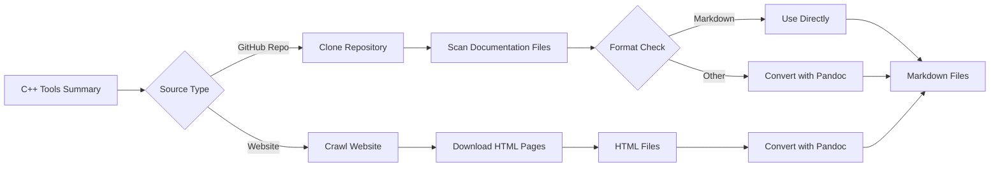
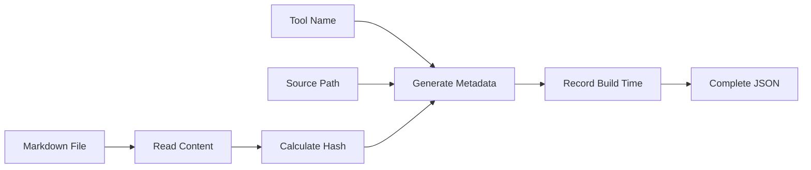
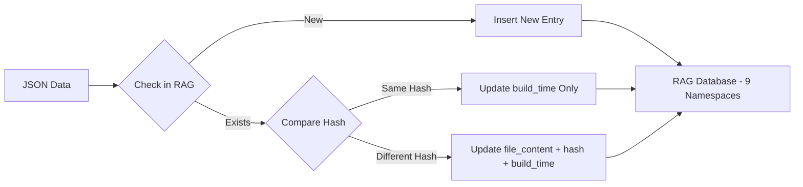

# C++ Tool Documentation RAG Pipeline Report

**Purpose:** Document collection, processing, and RAG pipeline integration for C++ development tools  
**Source:** C++ Tools Summary (9 categories, 40+ tools) 

---

## Overview

This report defines the workflow for collecting, processing, and uploading C++ tool documentation to a RAG pipeline with namespace-based organization.

---

## 1. Documentation Collection

### Source Types

**Type A: GitHub Repositories**
- Documentation formats: Markdown, AsciiDoc, ...
- Access method: Clone repository
- Examples: Visual Studio, VS Code, vcpkg, CMake

**Type B: Official Websites**
- Documentation format: HTML pages
- Access method: Web crawling
- Examples: JetBrains CLion, some commercial tools

### Conversion Process

All documentation is **converted to Markdown** using pandoc:

```
Source Formats → Pandoc → Markdown
- Markdown → Use directly (no conversion)
- AsciiDoc → Convert to Markdown
- HTML → Convert to Markdown
```

**Result:** Unified markdown format for all tools

---

## 2. RAG Pipeline Structure

### Namespace Organization

**9 Namespaces** based on tool categories:

| Namespace | Category | Tools |
|-----------|----------|-------|
| `ns-1-ide` | Development Environment & IDEs | 6 tools |
| `ns-2-build` | Build Systems | 4 tools |
| `ns-3-package` | Package Managers | 2 tools |
| `ns-4-compiler` | Compilers & Toolchains | 3 tools |
| `ns-5-testing` | Testing Frameworks | 2 tools |
| `ns-6-quality` | Code Quality & Analysis | 8 tools |
| `ns-7-debug` | Debugging & Profiling | 12 tools |
| `ns-8-docs` | Documentation Generation | 2 tools |
| `ns-9-cicd` | CI/CD | 3 tools |

Each namespace contains all documentation for tools in that category.

---

## 3. Data Structure for RAG

### Content and Metadata

Each RAG entry contains:
- **Content:** The actual markdown documentation text
- **Metadata:** 4 fields describing the content

```json
{
  "file_content": "# Title\n\nContent...",
  "metadata": {
    "tool_name": "Visual Studio",
    "file_path": "docs/ide/refactoring.md",
    "hash": "abc123...",
    "build_time": "2024-01-21T10:30:00Z"
  }
}
```

### Field Definitions

| Field | Type | Description | Example |
|-------|------|-------------|---------|
| `file_content` | **Content** | Markdown documentation text | `"# Title\n\nContent..."` |
| `tool_name` | **Metadata** | Tool name | `"Visual Studio"` |
| `file_path` | **Metadata** | Source path from collection | `"docs/ide/refactoring.md"` or `"https://example.com/docs/guide"` |
| `hash` | **Metadata** | SHA-256 hash of file_content | `"abc123..."` |
| `build_time` | **Metadata** | Generation timestamp | `"2024-01-21T10:30:00Z"` |

---

## 4. Workflow

### Stage 1: Documentation Collection



**Explanation:** Collect documentation from each tool's source (GitHub repository or website), then convert all formats to unified markdown using pandoc. Markdown files are used directly without conversion.

---

### Stage 2: Data Preparation



**Explanation:** Combine pre-defined tool name and source path with markdown content to create RAG entry. Calculate SHA-256 hash for change detection and record build timestamp.

---

### Stage 3: RAG Pipeline Upload



**Explanation:** Upload to appropriate namespace based on tool category. Use hash comparison to determine if content changed: if same, update timestamp only; if different, update content, hash, and timestamp. New files are inserted directly.

---

## Summary

- **Input:** 40+ C++ tools across 9 categories
- **Output:** Unified markdown documentation in RAG pipeline with 9 namespaces
- **Data:** Content (markdown text) + 4 metadata fields (tool_name, file_path, hash, build_time)
- **Update:** Hash-based comparison enables efficient incremental updates
